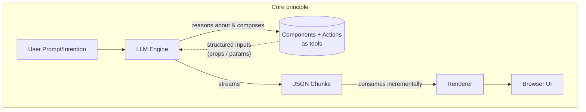

# Agentic Generative UI Solution

## Overview

DECL (Declarative Component Language) is a system for generating UI from natural language prompts. The key insight: **treat components and actions as tools that AI can reason about and compose**. This turns UI generation into a tool-use problem—something AI models excel at.

---

## Core Principle

**If you treat component inputs and actions as tools, UI generation becomes an AI reasoning problem—which AI is very good at.**

The architecture is built on four concepts:

- **Components** = Tools that take structured inputs (props) and produce UI
- **Actions** = Tools that handle the UI boundary—communication with external systems (server requests, reading/writing data)
- **LLM Engine** = Reasons about which tools to use, how to compose them, and what inputs to provide
- **JSON Chunks** = LLM returns structured JSON chunks as streaming messages; the renderer consumes them incrementally to update the UI in real-time

Instead of teaching AI UI-specific patterns, we leverage its natural strength in tool-use and reasoning.

---

## Architecture Extensibility

This approach generalizes beyond UI generation:

- **Any JSON structure** can be streamed and rendered incrementally using the same pattern
- **Domain-agnostic**: as long as the renderer can progressively consume JSON chunks, it can handle streaming updates



---

## How It Works

**Simple Pipeline:**
```
User Prompt → AI selects tools (Components + Actions) → Generates DeclSpec (view + data) → Renderer creates React component tree → Browser renders UI
```

**Key Design Decisions:**
- Use JSON Schema to describe component and action parameters
- Streaming output format: array of `{ view: [...] }` or `{ data: {...} }` chunks
- Components and actions registered in separate catalogs with definitions
- Two-way data binding via `dataBind` prop and store variables via `{path}` syntax

---

### 1. Type Definitions

Core types used throughout the system (defined in `src/services/decl/types.ts`):

```typescript
// A single node in the DECL view tree (instance of a component)
interface DeclNode {
  key: string           // Unique identifier for this node
  type: string          // Component type (must match registered component)
  props?: Record<string, any>  // Component properties
  children?: string[]   // Array of child node keys (references)
}

// View tree: array of DeclNodes (flattened tree)
type DeclView = DeclNode[]

// Data backing the view (store / view model)
type DeclData = Record<string, any>

// Complete UI spec: view tree + data
interface DeclSpec {
  view: DeclView
  data: DeclData
}
```

---

### 2. Component Registry

Components are registered in `src/components/decl/index.ts` with their JSON Schema definitions:

```typescript
interface ComponentDefinition {
  name: string
  description: string
  params?: Record<string, JSONSchema>
  load?: () => Promise<any>
  resolveProps?: ResolvePropsCallback  // Optional: transform DECL props to component props
}

const componentImportMap: Record<string, ComponentDefinition> = {
  // ....
  Field: {
    name: 'Field',
    description: 'Form field driven by a Property in the store via dataBind',
    params: {
      dataBind: {
        type: 'string',
        description: 'Dot-separated path to a Property object in the store'
      }
    },
    load: () => import('./Field'),
    resolveProps: (props, context) => {
      // Convert dataBind to property + onChange
      const processed = { ...props }
      if (processed.dataBind) {
        const binding = createDataBind(processed.dataBind, context)
        processed.property = binding.get()
        processed.onChange = (value) => binding.set({ ...processed.property, value })
        delete processed.dataBind
      }
      return processed
    }
  }
  // ....
}
```

**Registry Functions:**
```typescript
// Get all component definitions (for AI prompt)
getAllComponentDefinitions(excludeLoad?: boolean): ComponentDefinition[]

// Load a component by name
loadComponent(name: string): Promise<any>

// Check if component exists
hasComponent(name: string): boolean

// Register a new component at runtime
registerComponent(name: string, component: any, params?: JSONSchema, description?: string): void
```

---

### 3. Action Registry

Actions are registered in `src/services/actions.ts`:

```typescript
interface ActionDefinition {
  name: string
  description: string
  params?: Record<string, JSONSchema>
  returns?: JSONSchema
  handler?: (...args: any[]) => any | Promise<any>
}

const actionMap: Record<string, ActionDefinition> = {
  // ....
  submit: {
    name: 'submit',
    description: 'Submit form data',
    params: {
      data: {
        type: 'object',
        description: 'Store path to form data. Use "{storePath}" syntax.'
      }
    },
    handler: async (params) => {
      // Process and submit form data
      toast.success('Form submitted!', { description: JSON.stringify(params) })
    }
  },
  // ....
}
```

**Registry Functions:**
```typescript
// Get all action definitions (for AI prompt)
getAllActionDefinitions(excludeHandler?: boolean): ActionDefinition[]

// Load an action handler by name
loadAction(name: string): Function | null

// Check if action exists
hasAction(name: string): boolean

// Register a new action at runtime
registerAction(name: string, handler: Function, params?: JSONSchema, description?: string): void
```

---

### 4. AI Output Format

The AI generates a **streaming array of update chunks**. Each chunk has exactly one key: `view` or `data`.

**Streaming Format:**
```json
[
  { "data": { "pageTitle": "Contact Us" } },
  { "view": [{ "key": "root", "type": "Card", "props": { "title": "{pageTitle}" }, "children": ["form1"] }] },
  { "data": { "profile": { "firstName": { "type": "text", "name": "First Name", "value": "", "placeholder": "First name" } } } },
  { "view": [{ "key": "form1", "type": "Form", "props": {}, "children": ["f1", "submitBtn"] }] },
  { "view": [{ "key": "f1", "type": "Field", "props": { "dataBind": "profile.firstName" } }] },
  { "view": [{ "key": "submitBtn", "type": "Button", "props": { "text": "Submit", "onClick": { "name": "submit", "params": { "data": "{profile}" } } } }] }
]
```

**Chunk Rules:**
- Each chunk = one array element with exactly one key: `"view"` or `"data"`
- Data chunks should be small (1-2 fields) and interleaved with view chunks
- Client appends view arrays and deep-merges data objects
- This enables incremental rendering as chunks arrive

**View Node Structure:**
- `key`: Unique identifier (used for references and React keys)
- `type`: Component type (must match registered component)
- `props`: Component properties (validated against JSON Schema)
- `children`: Array of child node keys (references, not nested objects)

---

### 5. Data Binding

**Store Variables (`{path}` syntax):**
```json
{
  "data": { "userName": "John", "position": { "x": 10, "y": 20 } },
  "view": [
    { "key": "label", "type": "Label", "props": { "text": "{userName}" } },
    { "key": "info", "type": "Label", "props": { "text": "{position.x}" } }
  ]
}
```

**Two-Way Binding (`dataBind` prop):**
```json
{
  "data": { 
    "profile": { 
      "email": { "type": "email", "name": "Email", "value": "", "placeholder": "Enter email" }
    }
  },
  "view": [
    { "key": "emailField", "type": "Field", "props": { "dataBind": "profile.email" } }
  ]
}
```

**Property Object Shape (for Field component):**
```typescript
interface Property {
  type: 'text' | 'email' | 'number' | 'password' | 'select' | ...
  name: string          // Label text
  value: any            // Current value
  placeholder?: string
  readOnly?: boolean
  disabled?: boolean
  description?: string
  options?: { value: string; label: string }[]  // For select type
}
```

---

### 6. Code Generation API

The `generate` function in `src/services/decl/declCodeGenerator.ts`:

```typescript
import { generate, type DeclSpec } from '../services/decl'
import { getAllComponentDefinitions } from '../components/decl'
import { getAllActionDefinitions } from '../services/actions'

// Generate with streaming updates
const spec = await generate('Create a contact form', {
  componentDefinitions: getAllComponentDefinitions(true),  // Exclude load functions
  actionDefinitions: getAllActionDefinitions(true),        // Exclude handlers
  onUpdate: (streamingSpec: DeclSpec) => {
    // Called on each streaming update
    setDeclSpec(streamingSpec)
  }
})
```

---

### 7. Renderer

The `DeclGenRenderer` component renders a `DeclSpec`:

```typescript
import DeclGenRenderer from '../components/react/DeclGenRenderer'

// declSpec: undefined = loading, null = error, DeclSpec = render
<DeclGenRenderer declSpec={declSpec} />
```

**Render Context:**
```typescript
interface RenderContext {
  declNodes: Map<string, DeclNode>           // All nodes by key
  loadedComponents: Map<string, any>         // Loaded React components
  loadedActions: Map<string, Function>       // Loaded action handlers
  dataStore: DeclData                        // Current data store
  setDataStore: (updater: (prev) => DeclData) => void  // Update data store
}
```

**Rendering Process:**
1. Convert view array to Map for fast lookups
2. Find root nodes (nodes not referenced as children by any other node)
3. For each node, resolve props using `resolveProps` callback if defined
4. Replace `{path}` variables with store values
5. Convert child key arrays to rendered React nodes
6. Create React elements recursively

---

### 8. Available Components

| Component | Description | Key Props |
|-----------|-------------|-----------|
| Card | Container with header/content/footer | title, description, content, footer, children |
| Button | Clickable button with action | text, variant, size, onClick |
| Form | Form wrapper | children |
| Field | Data-bound form field | dataBind |
| TextBox | Text input with data binding | dataBind, placeholder, type |
| Label | Text label | text |
| Input | Basic input field | type, placeholder |
| ExistWhen | Conditional rendering | condition, children |
| Breadcrumb | Navigation breadcrumb | separator |

---

### 9. Available Actions

| Action | Description | Params | Returns |
|--------|-------------|--------|---------|
| submit | Submit form data | data: object | - |
| navigate | Navigate to URL | url: string | - |
| getValue | Get position and weight | - | { position, weight } |
| plusOne | Increment a number | value: number | { value: number } |

**Action Returns Mapping:**
```json
{
  "onClick": {
    "name": "getValue",
    "params": {},
    "returns": { "position": "result.pos", "weight": "result.w" }
  }
}
```

---

